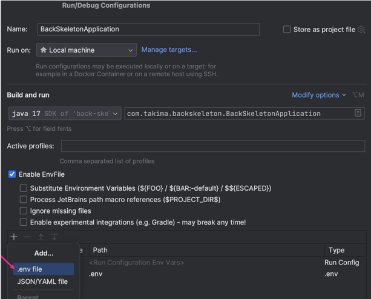

# Back-End - Java Spring Boot Application

## Prérequis

- **JDK** : Installez le JDK **Corretto 17** ou un autre JDK compatible avec Java 17.
- **Docker** : Assurez-vous que Docker est installé et configuré.
- **PostgreSQL** : La base de données est configurée via Docker.

## Étapes pour configurer et lancer le Back-End

### 1. Configuration du `.env`

Créez un fichier `.env` à la racine du projet contenant les variables nécessaires. Exemple :
```
DATABASE_USER=root
DATABASE_PASSWORD=toor
DATABASE_NAME=default-db
```
Vous pouvez garder ces valeurs-ci :).

---

### 2. Démarrage de la base de données avec Docker

Setup la base de données :
Cliquez sur l'icone "Database", puis appuyez sur le "+", et sélectionnez PostgreSQL.
Enfin remplissez les champs correspondant aux valeurs de votre .env et validez.

Éxecutez les scripts SQL suivants trouvés dans initdb après avoir setup votre database :
"1_TABLES.sql", "2_DEFAULT_ENTRIES.sql"

Voici la commande pour démarrer la bdd :

```
docker compose up
```

### 3. Configurer le SDK

Allez dans File > Project Structure et assurez-vous que le SDK est défini sur Corretto 17 ou un JDK compatible.

### 4. Lancer l'application (●'◡'●)

Modifiez la configuration de run pour qu'elle utilise le .env, puis lancez l'application :
1. 
2. 
3. 
